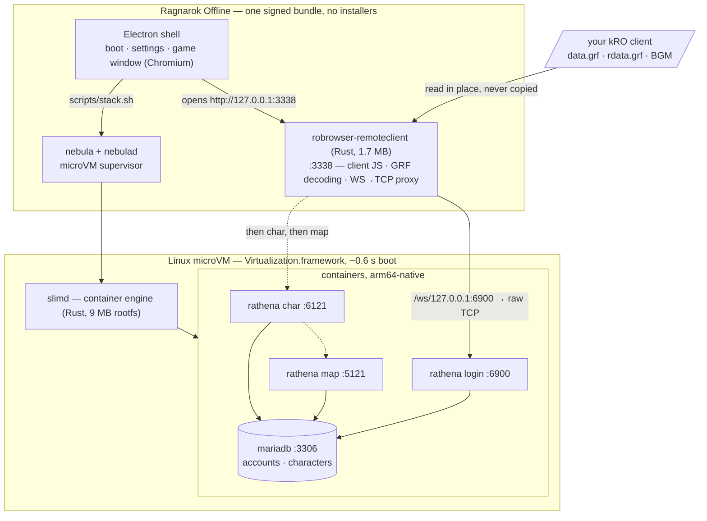
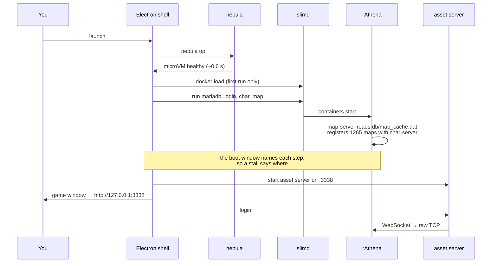

<p align="center">
  
</p>

# Ragnarok Offline

<sub>Icon generated with GPT Image 2. No Gravity assets used.</sub>

A single, self-contained app that runs **Ragnarok Online offline** — server, client,
and game window in one icon. Double-click it and you are in Midgard after obtaining
the assets. macOS, Linux and Windows.

**[Join the Discord](https://discord.gg/jUYC9dMbu5)** for help getting set up, or
read [docs/TROUBLESHOOTING.md](docs/TROUBLESHOOTING.md). Bugs and feature
requests are welcome as [issues](../../issues).

## Getting started

**[Watch the setup walkthrough](https://youtu.be/1Ib_KqHDCLA)** — download,
assets, first launch — or follow the same three steps below.

**1. Download a build.** Grab the latest release for your platform from the
[releases page](../../releases).

**2. Get the game files for your Ragnarok client.** You will need to obtain these from another source. Put it
somewhere you can find again; unzipping a full client gives you a folder containing
`data.grf`, `rdata.grf` and a `BGM` folder, which is what the app looks for. **kRO '23 and a current 2026 client are both tested.**

Renewal or pre-renewal is a setting you can change in Settings → Game era, which keeps a separate set of
characters for each.

`rdata.grf` is optional. Older clients split renewal content into it; newer ones
ship a single `data.grf` with everything merged in, and either is fine.

A Latin American client is one of the newer kind: one `data.grf`, plus an
`event.grf` holding the seasonal versions of a few towns. Point the third
picker at `event.grf` if you want those, or leave it empty.

If you only want to join a friend who is hosting a server, see
[Hosting and playing with friends on your LAN](#hosting-and-playing-with-friends-on-your-lan)
— you do not need the assets at all.

**3. Open the app and point it at that folder.** The setup screen has a folder
picker: choose the folder you unzipped and it finds the rest. Then it starts the
server and drops you at the login screen.

The first launch takes a few minutes: it unpacks the runtime, boots the microVM, loads
the container images and initialises the database. You can see each step as it
progresses. Every launch after that is ~10-15 seconds.

Log in with **`ragnarok`** / **`ragnarok`** — the account is created for you on
first run — and make a character.

**`ragnarok` is a GM account.** It can use every `@` command including warping. 
With GM accounts your outfit generally always looks like a GM, so if you don't want that create your own non-GM account.

**To play as an ordinary character, make your own account.** On the login
screen, type your username with **`_M`** or **`_F`** suffix on the end, pick a
password, and press Login (example: `flux159_M` as the username). Note that it
doesn't matter if you pick `_M` or `_F`, you are still able to create male and
female characters after logging in. After your first account creation, you can 
login as `myname`  without the suffix. Both the name and the password need at least four characters.

Ordinary accounts have almost no `@` commands — rAthena keeps `@autoloot` and
`@showexp` for GMs. Settings → Mods → **player-commands** gives player characters some common commands.

**4. Optional: fill the world with people.** A private server is empty by
default. Settings → **Population** puts AI characters on the map with you —
hunting in the fields, standing around town, running vending stalls you can
actually buy from. See [Filling the world](#filling-the-world) below.

---

## Sharing with friends over the internet

Use **Settings → Multiplayer → Set up sharing over the internet**, then choose
**Share with friends → Copy invitation link**. Temporary session links need no
Cloudflare account or token; connecting your own fixed hostname is optional.
Friends open the HTTPS link in their browser and play on your running world.
See [setup, invitation expiry and Stop sharing](docs/FRIENDS_SHARING.md).

## Hosting and playing with friends on your LAN

Everyone on the same wifi can play together on one person's machine. Only the
host needs the game files.

**[Watch two machines play together](https://youtu.be/-7QMhD4R97k)** — hosting
on one, joining from another.

### If you are hosting

**1. Go to Settings, tick "Let other machines connect", and restart the server.**
The engine reads this when it starts, so the *Restart server* button is what
applies it. Off by default, the server listens only on your own machine.


**2. Copy the link next to *Your link* and send it to your friends.** One link
covers both ways of joining — pasted into the app, or opened in a browser — and
it only works for people who can already reach your computer on the network. The
first time you turn this on, your machine will likely ask you to approve local
network access — say yes, or nobody can connect.

**3. Keep the app running.** You are the server: when you quit, everyone's session
ends. Characters live on your machine too, so they stay with you rather than with
their owners.

### If you are joining

Joining a friend's server does not require you to download assets. On the setup
screen, just click **Join a friend** and paste the link that your friend sent.

Full links keep their HTTP or HTTPS scheme and port. A bare LAN address such as
`192.168.1.20` uses port 3338. HTTPS certificate failures must be fixed by the
host; the app does not bypass certificate verification.


The host serves the client and the artwork, so joining starts in seconds instead
of the few minutes a first run takes. You make your own character on their
server: on the login screen, add `_M` or `_F` to the end of a new username and
that account is created as you log in, if the host allows signup. Internet
invitations instead offer account creation before entering the game.

### Joining from a browser, with nothing installed

Ragnarokoffline.app uses roBrowserLegacy as the client interfce, 
and the host serves it over HTTP — so the same link opens the game 
in a normal browser. **Paste it into the address bar and play.**

The following is an example link, your host IP on your LAN may be different.
```
http://192.168.1.20:3338/
```
Anything on the same wifi network with a browser that does WebGL should work, 
including phones, but the mobile UI is not optimized.

The host still has to be hosting: the link is only live while their app is
running with *Let other machines connect* on.

### Switching between the two

The same app does both, and you can change your mind at any time. In Settings,
switch **Mode**:

<p>
  
  
</p>

Picking **Join a friend** asks for their address; **Play on my own server** takes
you back to hosting. Joining runs nothing locally — no server, no microVM — so
switching to it stops your stack, and switching back starts it again.

---

## Architecture

Under the hood it stitches together three existing projects:

| Piece | Project | Role |
|---|---|---|
| microVM orchestrator | [**nebula**](https://github.com/Flux159/nebula) | Runs the Linux side of the stack in a fast, embedded microVM |
| game server | [**rAthena**](https://github.com/rathena/rathena) | The open-source RO server emulator (login / char / map) + MariaDB |
| game client | [**roBrowserLegacy**](https://github.com/MrAntares/roBrowserLegacy) + [**RemoteClient**](https://github.com/Flux159/roBrowserLegacy-RemoteClient-Rust) | WebGL RO client, GRF asset server, and TCP↔WebSocket proxy |

The short version: **rAthena and roBrowserLegacy run inside Linux containers,
inside a microVM the app carries with it.** Nothing is ported. The hard
part of running an RO server on a Mac is not the server — it is that the server was
never meant to run on one. So we do not port it; we bring Linux. The same holds for
Windows, which is how one codebase covers three platforms.

Both are built from our forks,
[Flux159/rathena](https://github.com/Flux159/rathena) and
[Flux159/roBrowserLegacy](https://github.com/Flux159/roBrowserLegacy): upstream,
plus our fixes as ordinary commits we can send back upstream
([docs/FORKS.md](docs/FORKS.md)). What is ours alone is added at build time:
the client's stylist window, extension hooks and wording from `patches/` and
`scripts/patch-client.sh`, and on the server one optional modification compiled
in: the [Population Engine](https://github.com/YlenXWalker/Population-Engine),
which fills a solo world with AI characters and is **off unless you turn it on**
in Settings.

**We ship a modified copy of it.** It is GPL-3.0, like rAthena, and our changes
live in `third-party/population-engine/` — the engine's own sources with our
edits marked `RAGNAROKMAC`, plus patches for the files rAthena owns. We added a
master switch (upstream has none), made population follow the players rather
than filling all 124 maps at once, stopped the movement tick running for
characters nobody can see, made crowding a setting instead of a rebuild, and
took character levels from the monsters on each map. Shells can also be
recruited as player-controlled party companions. The spawn tables and gear sets
are edited too. That directory's README lists all of it, and the full
modified source is here in the repository as the licence requires.

The shell is **Electron**, so the same Chromium renders the client everywhere and
there is one renderer to test against rather than three.



Ports are published to `127.0.0.1` unless you turn on
[LAN hosting](#hosting-and-playing-with-friends-on-your-lan), which binds them to
your network interface instead. The GRFs stay wherever you keep them —
the app reads them in place through a private archive manifest, so a
3.5 GB client is never duplicated.

### What actually happens when you press play



### Why a microVM rather than a native build

rAthena officially targets Linux and Windows. macOS is not a supported platform
and Apple Silicon less so. Compiling it against Homebrew MariaDB works for some
people some of the time, which is precisely the fragility a shipped `.app`
cannot have.

So the server runs on the platform it is actually tested on, and we inherit
every upstream fix instead of maintaining a fork. The cost is a microVM, and
with nebula-slim that cost is small: a **9.4 MB** compressed guest rootfs
running `slimd` — a Rust container engine — rather than the ~130 MB of
dockerd + containerd + runc it replaces.

The same property is what makes this cross-platform. The Linux side does not
change between macOS, Windows and Linux; only the host-side VM integration does.

### What each piece is, and whose it is

| Piece | Origin | Role here |
|---|---|---|
| [rAthena](https://github.com/rathena/rathena) | upstream, GPL-3.0 | the server. Built arch-native at image build time from our fork, [Flux159/rathena](https://github.com/Flux159/rathena), plus the optional population engine below |
| [Population Engine](https://github.com/YlenXWalker/Population-Engine) | upstream, GPL-3.0 | server-side AI characters, compiled in but off by default. Vendored in `third-party/`, see its README |
| [roBrowserLegacy](https://github.com/MrAntares/roBrowserLegacy) | upstream, GPL-3.0 | the client. Built from source with a few patches in `patches/` |
| [RemoteClient](https://github.com/Flux159/roBrowserLegacy-RemoteClient-Rust) | GPL-3.0 | Rust rewrite of roBrowserLegacy's Node asset server |

---

## Filling the world

A server of your own is a quiet place. Turn on **Fake players** in Settings and
the world gets inhabitants: they walk, fight monsters, sit around town, and open
real vending stalls you can buy from. They never touch your characters or your
save.

<p align="center">

</p>

**How busy** is the one to reach for. It scales how crowded each map feels — the
readout tells you roughly how many characters you will see around you, and the
line underneath estimates the memory that costs. Start at 100% and move it if a
town feels too sleepy or too packed.

**Limit** is a safety ceiling across every map at once, not a headcount. Playing
alone you will never reach it: characters only exist on the maps you and your
friends are actually standing on, so leaving a map hands its inhabitants back
rather than keeping thousands of them alive somewhere you cannot see. That is
also why the world does not cost anything while you are not playing.

**Server memory** is how much the virtual machine may use, and it defaults to a
quarter of your computer's memory, up to 4 GB. On macOS it is a ceiling rather
than a reservation — idle memory goes back to you. **On Windows and Linux the
virtual machine holds it for as long as the server runs**, so on an 8 GB machine
leave room for Windows and your browser. Changing it restarts the virtual
machine, which takes a few seconds.

Characters are levelled to the map they are on, taken from the monsters that
live there, so a starting field holds beginners in plain gear and a late-game
map does not. Applying any of this restarts the server, so log back in
afterwards.

### Recruit up to eleven AI companions

Population characters can join your party and follow you between maps. Whisper
`party`, `pt`, `join`, or `invite` to one, then send it a normal party
invitation within 60 seconds. Recruited characters fight, buff, heal, hold a
small formation around you, and can be directed by the party leader through
party chat.

The three combat modes are Attack, Defensive, and Passive; individual
companions can be assigned Tank, Support, or Attacker roles. Priest companions
can resurrect party members, and dead companions can also be targeted with a
Yggdrasil Leaf. See the complete **[AI companion guide](docs/COMPANIONS.md)**
for commands, role behaviour, death rules, and current limitations.

If your machine gets hot, this is the setting to turn down: the AI characters
are the only part of the server that costs meaningful CPU. The game itself runs
on very little.

---

## English translation assets

kRO is Korean, and the translation comes from
[**ROenglishRE**](https://github.com/llchrisll/ROenglishRE). Its text tables ship
inside the app, so the game is in English out of the box with no extra step.

**If your client is not Korean, you can turn this off.** Settings → **Game
text** switches between the English translation and the text your client came
with, which is the one to use for a Latin American download that is already in
Spanish and Portuguese. It also picks how that text is decoded, so choose
*Western* for a Latin American, international or European client and *Korean*
for kRO. A few system messages the server sends by number show as `NO MSG 2580`
that way, because newer clients keep those in a format roBrowser does not read;
names, dialogue and quest text all come across.

If you also have that project's supplementary art pack — `official_data.grf`, which
contains no text at all, only translated sprites and textures — put it in the same
folder as your other GRFs. The app picks it up automatically and gives it priority
over the Korean artwork, so UI chrome, signage and item icons come out in English
too.

---

## Troubleshooting

Answers to the things people have actually hit — Windows blocking the app,
a client folder on the wrong drive, the virtual machine refusing to start,
the first login not taking, and moving your characters to another machine —
are collected in **[docs/TROUBLESHOOTING.md](docs/TROUBLESHOOTING.md)**.

Unexpected game-server exits also retain private [crash evidence](docs/CRASH_DIAGNOSTICS.md) before container cleanup. Native stack traces and the intermittent crash investigation remain in progress.

If yours is not there, the Settings window has a **Report a problem** button
that copies everything a fix needs — logs, paths, versions — and opens a new
issue ready to paste it into. Or ask in the
[Discord](https://discord.gg/jUYC9dMbu5).

---

## Modding

A mod is a folder. Drop it in the mods directory, restart, and it is live — no
rebuild, no compiler, no Docker.

You can change what monsters are worth and what they drop, add NPCs with real
quests, replace the login screen and the loading screens with your own art,
build a map that is in nobody's GRF and put monsters and NPCs on it, decide
where new characters wake up, and restyle the client itself. Settings → Mods
lists what is installed, with a checkbox each.

**[docs/MODDING.md](docs/MODDING.md)** is the guide, and
**[examples/mods/](examples/mods)** has eight worked examples — each one a mod
that has actually been run, with a README saying what it demonstrates. Copy the
folder closest to what you want.


## Documentation

**[flux159.github.io/ragnarokoffline.app](https://flux159.github.io/ragnarokoffline.app/)**
— installing, a page for each Settings tab, playing with friends, making mods
and troubleshooting. Source is in [docs-site/docs](docs-site/docs); the deeper
references for people working on the app stay in [docs/](docs).

## Playing from the keyboard

Skills and items go on the shortcut bar — `F1`–`F9`, `1`–`9`, and two more rows
— which is roBrowser's own and always there. The bundled `wasd-movement` mod
adds walking, `Q`/`E` camera turning and a spacebar attack on the nearest
monster. Those two share some keys, and you choose which wins:
**[docs/KEYBOARD_CONTROLS.md](docs/KEYBOARD_CONTROLS.md)**.

## Advanced features

Backing up and restoring your characters, where the app keeps its data on each
platform, how much disk it uses, and how to reset an install to a fresh state:
**[docs/ADVANCED_FEATURES.md](docs/ADVANCED_FEATURES.md)**.

The server's database can also be read and repaired directly, for the states
the game has no button for — a homunculus that cannot be called or replaced, a
character the server still thinks is online. `ragnarok-stack sql` is in the app
you already have: **[docs/DATABASE.md](docs/DATABASE.md)**.

---

## License

| Component | License |
|---|---|
| Ragnarok Offline | GPL-3.0 |
| [rAthena](https://github.com/rathena/rathena) | GPL-3.0 |
| [Population Engine](https://github.com/YlenXWalker/Population-Engine) | GPL-3.0 |
| [roBrowserLegacy](https://github.com/MrAntares/roBrowserLegacy) | GPL-3.0 |
| [ROenglishRE](https://github.com/llchrisll/ROenglishRE) | free to distribute, use and modify (see its headers) |
| [RemoteClient-Rust](https://github.com/Flux159/roBrowserLegacy-RemoteClient-Rust) | GPL-3.0 |
| [nebula](https://github.com/Flux159/nebula) | MIT |

Game assets are copyright of Gravity Co., Ltd. and are not bundled or shipped with
Ragnarok Offline.
